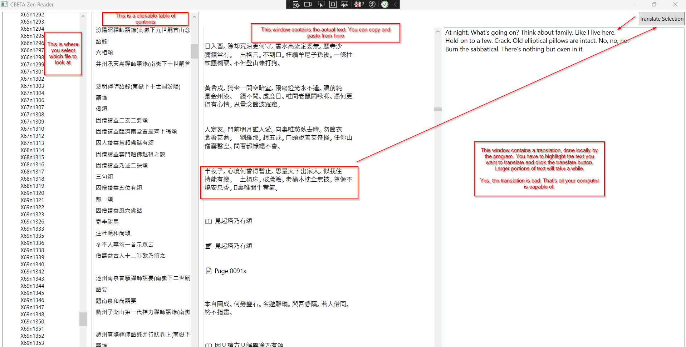

# CBETA Reader

**CBETA Reader** is a free, offline desktop application for browsing, reading, and translating Chinese Buddhist texts from the [CBETA XML-P5](https://www.cbeta.org/) corpus.

This is a minimal and fast reader designed specifically for Zen study and translation work.

---

## ✨ Features

- 📂 Browse CBETA XML-P5 by Canon and Sutra
- 📖 Read TEI-formatted texts with heading-aware formatting
- 📚 Automatic Table of Contents (based on `<mulu>` tags)
- 📋 Right-click TOC entries to copy headings
- 🌐 Offline machine translation (Traditional Chinese → English)
- 🧠 Built-in translation using **Argos Translate** (with bundled Python)
- 🪷 No internet required. No tracking. No ads.

---

## 📸 Screenshots

 <!-- Add one later -->

---

## 🧰 Requirements

- Windows 10 or 11 (64-bit) - I am very sorry about this.
- No .NET installation needed — it's bundled

---

## 🚀 Getting Started

1. Download the latest release from [Releases](https://github.com/your-username/cbeta-zen-reader/releases)
2. Get the CBeta archive from https://github.com/cbeta-org/xml-p5/tree/master
3. Unzip the archives you downloaded. CBeta is about 2 Gigabytes unzipped. You can also clone the git repository instead for full access to the history of edits.
4. Double-click `CbetaZenReader.exe`
5. On first launch, you'll be asked to locate your **CBETA XML-P5 root folder**
6. Select any text → Click "Translate Selection" to generate an English translation

---

## 🧠 Powered By

- [Argos Translate](https://www.argosopentech.com/) — Offline neural translation
- [CBETA XML-P5](https://www.cbeta.org/)
- .NET 8 WPF (self-contained deployment)

---

## 🔒 Privacy

CBETA Zen Reader runs completely offline. No network access, no telemetry, no tracking.

---

## 💡 Planned Features

- 🔍 Full-text search
- 🧭 Improved navigation through canonical structure
- 📘 Markdown / PDF export
- 📖 Parallel text mode for full sutra translation work

---

## 📜 License

MIT License

---

## 🙏 Acknowledgments

Thanks to the CBETA project and the open-source developers behind Argos Translate.